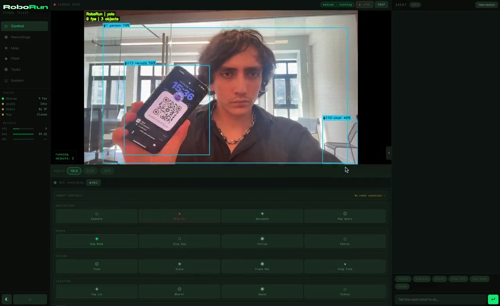

<div align="center">



<br />

# RoboRun

### The lightweight robot agent layer.<br/>49 MCP tools. Any ROS 2 robot. One `pip install`.

<br />

[](https://pypi.org/project/roborun/)
[](https://python.org)
[](LICENSE)
[](https://modelcontextprotocol.io)
[](https://ros.org)

<br />

```bash
pip install roborun && roborun
```

**That's it.** Browser opens. Webcam starts with YOLO + CLIP + JEPA running live.<br/>
Add a robot IP and you get fleet control, spatial memory, MuJoCo sim, and a Claude agent — from one tab.

<br />

[Quick Start](#quick-start) · [MCP Server](#mcp-server) · [Skills](#skills) · [Vision](#vision-models) · [Architecture](#architecture)

</div>

---

<br />

<table>
<tr>
<td width="50%" valign="top">

### Works with any MCP client

Claude Desktop, Claude Code, Cursor, Windsurf — add one line and your AI gets full robot control.

```json
{
  "mcpServers": {
    "roborun": {
      "type": "http",
      "url": "http://localhost:8765/mcp"
    }
  }
}
```

Or use stdio for CLI clients:

```json
{
  "mcpServers": {
    "roborun": {
      "command": "roborun-mcp"
    }
  }
}
```

</td>
<td width="50%" valign="top">

### What your AI gets

| | Surface | Count |
|---|---|---|
| **Tools** | Topic pub/sub, services, actions, camera, velocity, introspection, skills | **49** |
| **Prompts** | Guided workflows — explore, safety-check, patrol, debug, teach | **8** |
| **Resources** | Server info, skills, ROS graph, workflows, soul | **6** |
| **Template** | `roborun://topic/{path}` — live read from any ROS topic | **1** |

<br/>

Your AI can drive the robot, read sensors, chain tools into workflows, and run autonomous skills — all through the standard MCP protocol.

</td>
</tr>
</table>

<br />

---

## Quick Start

<table>
<tr>
<td width="33%">

### pip install

```bash
pip install roborun
roborun
```

</td>
<td width="33%">

### From source

```bash
git clone https://github.com/publu/RoboRun.git
cd RoboRun
pip install -e .
python -m roborun.server
```

</td>
<td width="33%">

### npx

```bash
npx roborun
```

</td>
</tr>
</table>

Open **http://127.0.0.1:8765**. Webcam starts automatically.

---

## MCP Server

Two transports, zero configuration:

| Transport | Endpoint | Use case |
|-----------|----------|----------|
| **HTTP+SSE** | `http://localhost:8765/mcp` | Claude Desktop, Cursor, web clients |
| **stdio** | `roborun-mcp` | Claude Code, CLI-based clients |

### 30 Built-in ROS Tools

Full robot control through MCP: topic discovery, pub/sub, service calls, action goals, parameter management, camera snapshots, depth images, velocity commands, and deep introspection of every node, topic, service, and action on the ROS graph.

### 8 Guided Prompts

| Prompt | What it does |
|--------|-------------|
| `explore-robot` | Walk through discovering a new robot's capabilities |
| `safety-check` | Pre-operation safety verification |
| `environment-scan` | Full environment survey with camera + sensors |
| `teach-waypoints` | Interactive waypoint teaching for patrol routes |
| `debug-topic` | Diagnose a misbehaving topic step by step |
| `quick-start` | First-time onboarding in 60 seconds |
| `fleet-sweep` | Multi-robot status check across your fleet |
| `build-workflow` | Create a reusable tool chain |

### 6 Resources + Live Topic Template

| Resource | Description |
|----------|-------------|
| `roborun://server-info` | Server version, uptime, capabilities |
| `roborun://skills` | Loaded skills and their tools |
| `roborun://ros-graph` | Live ROS topic/service/node graph |
| `roborun://workflows` | Saved compose workflows |
| `roborun://prompts-catalog` | All available prompts |
| `roborun://soul` | Agent behavioral identity |
| `roborun://topic/{path}` | **Live** read from any ROS topic |

---

## Skills

Plugin-based skill system. Drop a Python file, get new MCP tools.

**4 loading paths:**

```
Built-in skills                     → ships with RoboRun
ROBORUN_SKILL_PACKAGES=pkg1,pkg2    → pip packages
ROBORUN_SKILL_PATHS=/path/to/skills → filesystem directories
.roborun/skills.yaml                → project-level config
```

### Built-in Skills

| Skill | Tools | What it does |
|-------|:-----:|-------------|
| **compose** | 5 | Chain any tools into reusable workflows. `run_sequence` > `save_workflow` > `run_workflow` |
| **inspect** | 3 | `robot_brief` (one-call overview), `watch_topic` (conditional monitoring), `diff_state` (detect graph changes) |
| **follow_me** | 1 | Visual person-following with P-control on camera feed |
| **patrol** | 5 | Autonomous waypoint patrol loop with configurable dwell times |
| **scan_detect** | 2 | Rotate-and-detect object search using YOLO + CLIP fallback |

### Write Your Own

```python
SKILL_TOOLS = [
    {"name": "my_tool", "description": "Does a thing",
     "inputSchema": {"type": "object", "properties": {"x": {"type": "string"}}}}
]

def handle(name: str, args: dict) -> str:
    if name == "my_tool":
        return f"Got: {args.get('x')}"
```

Drop it anywhere, point `ROBORUN_SKILL_PATHS` at the directory. Done.

---

## Vision Models

All models run in real-time on your webcam or robot camera. Toggle from the model bar in the UI.

| Model | What it does | Overlay | Install |
|-------|-------------|---------|---------|
| **YOLO** | Object detection + tracking | Bounding boxes + IDs | `pip install roborun[vision]` |
| **CLIP** | Zero-shot text-image search | Highlighted matches | `pip install roborun[vision]` |
| **JEPA** | Self-supervised visual features | Attention heatmap | `pip install roborun[jepa]` |
| **Cosmos 3** | 16B world model (MLX 4-bit) | API only | [cosmos-mac](https://github.com/publu/cosmos-mac) |

---

## ROS 2 Transport

Connects to any robot running `rosbridge_server`. No ROS installation needed on the host machine.

```bash
# On the robot
ros2 launch rosbridge_server rosbridge_websocket_launch.xml

# From RoboRun — set robot IP in the UI, or:
curl -X POST http://localhost:8765/api/ros/connect \
  -d '{"host":"192.168.1.100"}'
```

Also supports **direct DDS** via CycloneDDS for zero-latency local transport:

```bash
pip install roborun[ros]
```

---

## Agent

Built-in Claude + Gemini agent with streaming, tool use, and vision.

- **Dynamic ROS context** — live topics, services, and nodes are injected into the system prompt automatically
- **Safety velocity clamping** — configurable limits prevent runaway commands (`ROBORUN_MAX_LINEAR_VEL`, `ROBORUN_MAX_ANGULAR_VEL`)
- **Persistent memory** — facts persist across sessions in `.roborun/agent_memory.json`
- **Behavioral identity** — define safety rules and interaction style in `.roborun/SOUL.md`

---

## Architecture

```
Browser (RoboRun UI)
    |
    +-- /api/webcam/*      -> WebcamPipeline (YOLO + CLIP + JEPA)
    +-- /api/dataset/*     -> DatasetCollector (episode recording)
    +-- /api/ros/*         -> RosbridgeClient (any ROS 2 robot)
    +-- /api/agent/chat    -> Claude / Gemini agent with MCP tools
    +-- /api/fleet/*       -> Fleet + Blueprint management
    +-- /api/tasks/*       -> Task scheduler
    +-- /api/memory/*      -> SpatialMemoryStore (CLIP search)
    +-- /api/sim/*         -> MuJoCo physics simulation
    +-- /mcp               -> MCP HTTP+SSE transport
    +-- roborun-mcp        -> MCP stdio transport
```

<details>
<summary>Project structure</summary>

```
roborun/
+-- server.py          # Thin HTTP shell, route dispatch
+-- ros_mcp.py         # 30 built-in ROS MCP tools
+-- mcp_stdio.py       # Stdio transport (prompts, resources, logging)
+-- agent.py           # Claude + Gemini agents
+-- rosbridge.py       # WebSocket ROS 2 transport
+-- simulator.py       # MuJoCo headless simulation
+-- webcam.py          # Webcam capture + model pipeline
+-- spatial_memory.py  # CLIP-indexed geo-searchable memory
+-- skills/            # Plugin skill modules
+-- routes/            # HTTP route handlers (12 modules)
```

</details>

---

## Configuration

<details>
<summary>Environment variables</summary>

| Variable | Default | Description |
|----------|---------|-------------|
| `ROBORUN_PORT` | `8765` | Server port |
| `ROBOT_IP` | -- | Robot IP (can also set in UI) |
| `ANTHROPIC_API_KEY` | -- | Enables Claude agent |
| `GEMINI_API_KEY` | -- | Enables Gemini agent |
| `ROBORUN_SKILL_PACKAGES` | -- | Additional skill packages |
| `ROBORUN_SKILL_PATHS` | -- | Additional skill directories |
| `ROBORUN_MAX_LINEAR_VEL` | `1.0` | Safety velocity limit (m/s) |
| `ROBORUN_MAX_ANGULAR_VEL` | `1.5` | Safety angular limit (rad/s) |

</details>

### Optional Dependencies

```bash
pip install roborun[vision]   # YOLO + CLIP + OpenCV
pip install roborun[ros]      # Direct DDS (CycloneDDS)
pip install roborun[gemini]   # Gemini agent
pip install roborun[zk]       # ZK proofs (EZKL + ONNX)
pip install roborun[all]      # Everything
```

---

<details>
<summary><b>Full Changelog</b></summary>

### v0.8.0 — Skills, MCP prompts/resources, codebase overhaul

- Skills plugin system — 4 loading paths, 5 built-in skills, skill template
- Compose skill — chain tools into reusable workflows
- Inspect skill — `robot_brief`, `watch_topic`, `diff_state`
- 8 MCP prompts — guided workflows for exploration, safety, debugging
- 6 MCP resources + topic template
- MCP logging on every tool call
- 49 total tools (30 ROS + 19 skill)
- Route decomposition — server.py from 2300 to 200 lines
- Removed all hardcoded vendor references — works with any ROS 2 robot
- Safety velocity clamping, dynamic ROS context, persistent agent memory

### v0.7.0 — Unified ROS MCP, DDS + rosbridge

- 30 ROS MCP tools — full introspection, pub/sub, services, actions, params
- Dual transport — rosbridge WebSocket + direct DDS via CycloneDDS
- MCP stdio transport for CLI clients

### v0.6.0 — 3D scene builder, ROS telemetry

- 3D scene builder — depth-based point cloud reconstruction
- ROS telemetry bridge — battery, IMU, odom, joint states
- WebSocket telemetry — real-time charts

### v0.5.0 — 3D spatial perception, drone support

- Telemetry dashboard with WebSocket-powered charts
- 3D trajectory visualization with Three.js
- Point cloud viewer, drone support with MuJoCo quadrotor

### v0.4.0 — MCP server, native ROS 2

- MCP HTTP server at `/mcp`
- Native ROS 2 transport via rosbridge
- ZK proof layer for CLIP embeddings

### v0.3.0 — MuJoCo simulator, spatial memory

- MuJoCo physics with ONNX locomotion policies
- CLIP-searchable, geo-indexed spatial memory

### v0.2.0 — Cosmos 3, JEPA heatmaps

- Cosmos 3 Nano 16B world model via MLX 4-bit
- JEPA attention heatmaps, CLIP zero-shot search

### v0.1.0 — Initial release

- WASD teleop, YOLO detection, CLIP search, dataset recording
- Claude agent chat, fleet management, task scheduler

</details>

---

<div align="center">

MIT License

**[GitHub](https://github.com/publu/RoboRun)** · **[PyPI](https://pypi.org/project/roborun/)** · **[npm](https://www.npmjs.com/package/roborun)**

</div>
